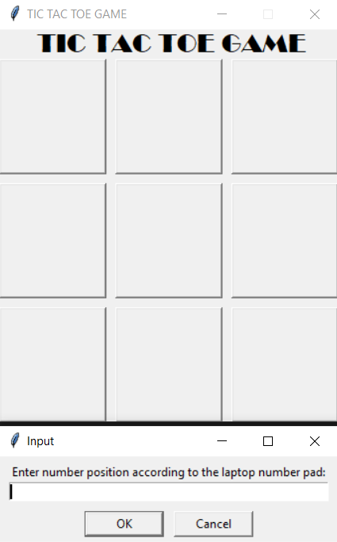

# Tic Tac Toe

A simple app that allows the user to play tic tac toe against the computer where the computer auto-generates possible movies in order to win against the user.

## Table of Contents
- [Purpose](#purpose)
- [Technologies and Libraries Used](#technologies-and-libraries-used)
- [Setup](#setup)
- [Repository Information](#repository-information)
- [Usage](#usage)

## Purpose
This app was created to learn the basics of AI and how to create a simple AI that can play tic tac toe against the user. I practice using the tkinter library and to practice using functions in Python.

## Technologies and Libraries Used
- Programming Language
    - Python
- Libraries
    - tkinter

## Setup
Make sure to git clone this repository. After cloning, make sure the latest version of Python and all mentioned packages are installed and the project is ready for use!

## Repository Information
The main.py file contains the code for the GUI and the functions that allow the user to play against the computer. 

## Usage
To use the application, run the main.py file. This will open the GUI. 
The GUI will look like this:

<kbd></kbd>

- To use the application, enter the number where you want to place your X in the input box and click the submit button. 
- The computer will then place an O in an attempt to win the game. 
- The game will continue until either the user or the computer wins or the game ends in a tie.
